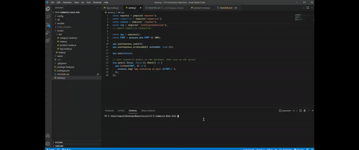
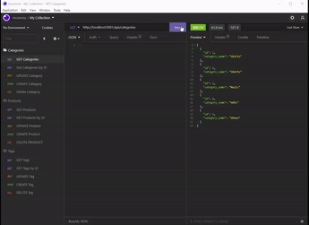
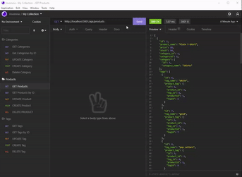
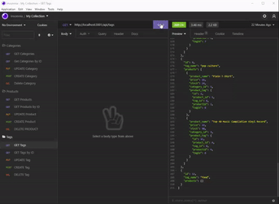

# 13 Object-Relational Mapping (ORM): E-Commerce Back End

[](https://opensource.org/licenses/MIT)

  ## Description:
  Ecommerce Back End is a website that allows a user to view/update/delete/create data for categories, products that are associated with each category, and product tags that are associated with each product tags.

  This program was created using Javascript, Sequelize to access the MySQL database, and Express.js to listen to different routes for posting/deleting/updating/fetching data for categories, products, and product tags.

  
  
  ## Route Examples

  ### Categories

  

  ### Products

  

  ### Tags

  

  ## Table of Contents 
  - [Description](#description)
  - [License](#license)
  - [Usage](#usage)
  - [Features](#features)
  - [Contribution](#contribution)
  - [Questions](#questions)

  ## License:
  [](https://opensource.org/licenses/MIT)

  ## Usage:
  - Clone this repository on your local machine.
  - Open your terminal
  - To install necessary dependencies, type:
  ```
  npm install
  ```
  - To connect to the example database, first source the database schema by logging in to your mysql database and typing:
  ```
  source schema.sql;
  ```
  - Next connect your mysql to the backend by placing your login credentials within a .env file in the root directory, ensure the `dotenv package is installed`
  - To seed the example database, type:
  ```
  npm run seed
  ```
  - The start the server, run:
  ```
  node server.js
  ```
  - The backend should now be hosted on `localhost:3001`

  ## Features

  The Application allows the User to:
  - View All Product Categories
  - View All Product Categories by ID
  - Update Product Categories
  - Create Product Categories
  - Delete Product Categories
  - View All Products
  - View All Products by ID
  - Update Products
  - Create Products
  - Delete Products
  - View All Product Tags
  - View All Product Tags by ID
  - Update Product Tags
  - Create Product Tags
  - Delete Product Tags

  ## Questions:
  Have any questions?\
  Feel free to contact me at:
  - Github: [OmarAce](https://github.com/OmarAce)
  - Email: omarace95@gmail.com